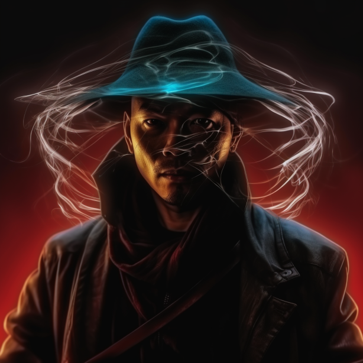
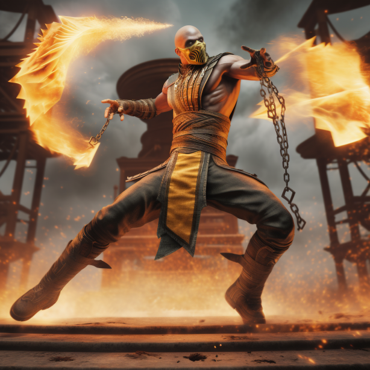
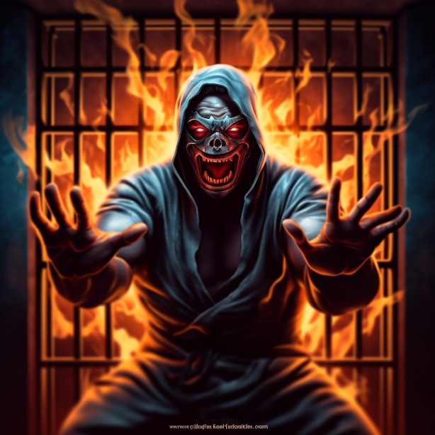
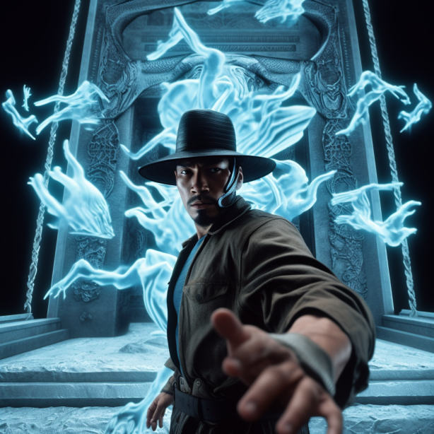
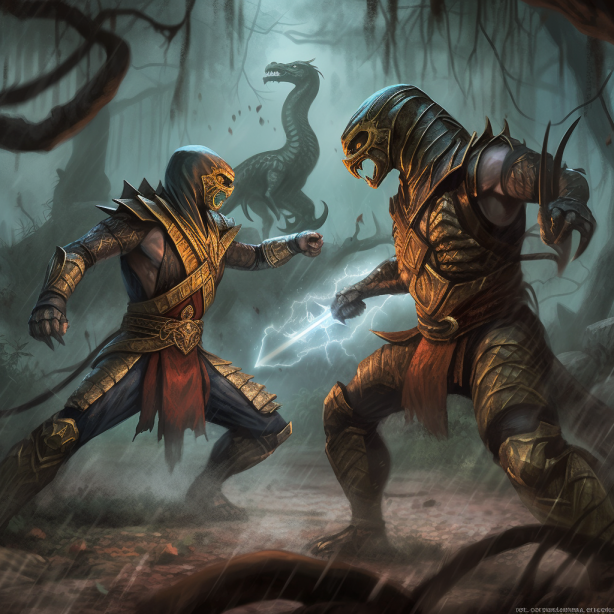
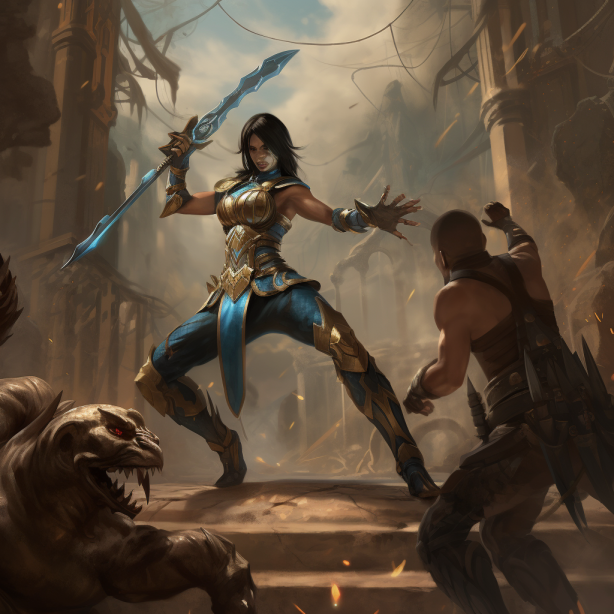
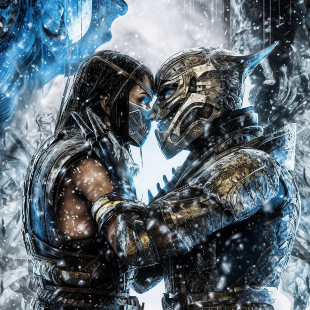
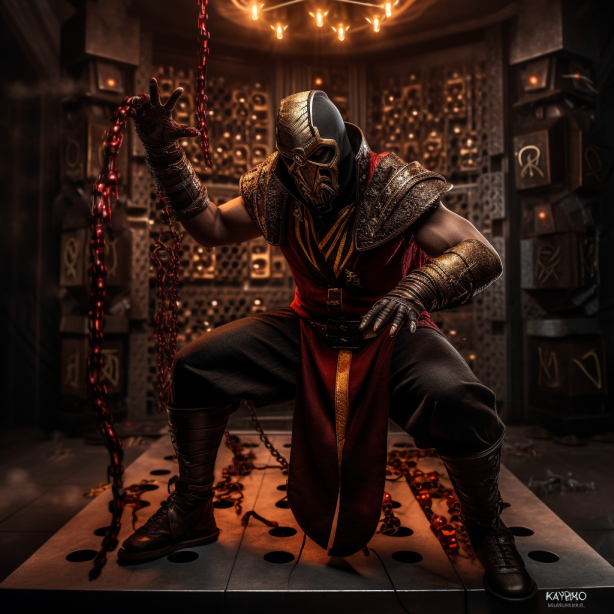
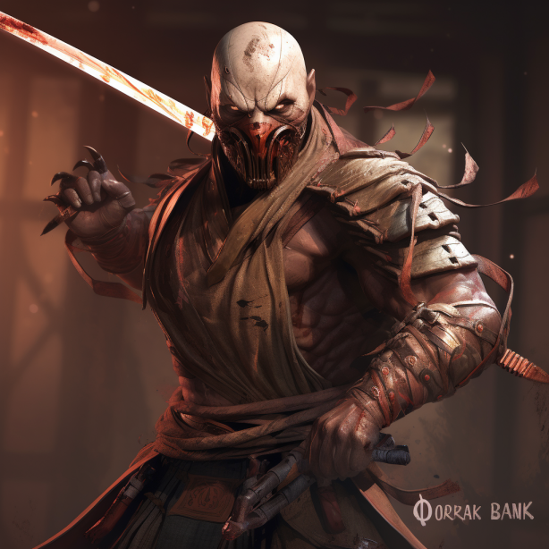
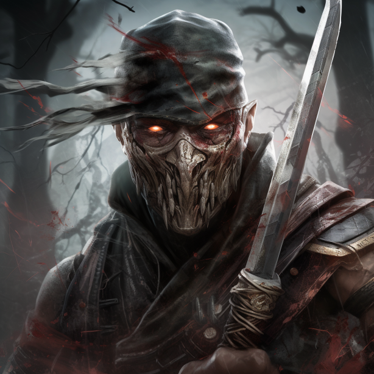

# Mortal Kombat
Welcome to the Midjourney Research Project repository dedicated to the study of "Mortal Kombat." Here, you will find a collection of images and code that serve as a foundation for conducting experiments and research in order to identify the most effective prompts for various requirements related to this iconic book series.

## Objective
Our primary objective in creating prompts for Mortal Kombat is to stimulate engaging and imaginative discussions, as well as written responses that revolve around the beloved book series. These prompts aim to encourage creativity and exploration within the Mortal Kombat universe.

## Directory Structure
This repository is organized into the following directories:

Imagine: This directory contains the best images created using prompts generated by our code in the prompt playground. These images are a visual representation of the creative output our prompts inspire.

Describe: In this directory, you will find images created using prompts specifically related to Mortal Kombat. These prompts are tailored to generate descriptions and narratives based on the series.

Blend: The Blend directory houses images that are the result of blending the 25 best images generated through our prompts. This provides an interesting perspective on combining creative outputs.

Notebooks: This directory contains Python code necessary for generating Midjourney prompts, particularly for the "Imagine" section. You can explore and utilize these notebooks to create your own prompts.

Tags: Within this directory, you will find lists of tags relevant to the Mortal Kombat topic. These tags are categorized for easier navigation and reference, aiding in the prompt generation process.

## Weekly Report
We have been actively using a variety of prompts to generate images and creative content. Here is a list of prompts that have been employed in our research:

character_selection
action_or_pose
setting_or_environment
iconic_elements
styles
formats
boosters
views
artists
mediums
lights
colors
decades
mj_prompts
mj_parameters

These prompts have played a crucial role in inspiring and guiding our research, leading to fascinating outcomes related to Mortal Kombat.

## Best results

1. 
2. 
3. 
4. 
5. 
6. 
7. 
8. 
9. 
10. 